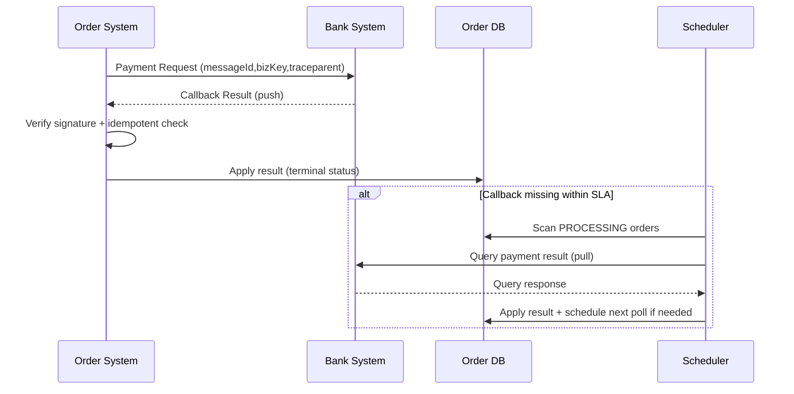

# OpenTelemetry Design for Callback Push + Poll Pull
（回调 Push + 轮询 Pull 场景的 OpenTelemetry 设计）

## 1. Scope / 范围

**EN**  
This document defines observability design for asynchronous result convergence in cross-system interactions (e.g., Order <-> Bank), where:
- Push callback is the primary path
- Pull polling is the fallback path
- Both paths must be traceable and measurable with OpenTelemetry

**中文**  
本文档定义跨系统异步结果收敛场景（例如订单 <-> 银行）的可观测性方案：
- Push 回调为主路径
- Pull 轮询为兜底路径
- 两条路径都必须可追踪、可度量（OpenTelemetry）

---

## 2. Design Principles / 设计原则

### 2.1 Consistent Correlation Keys / 统一关联键

**EN**
- `messageId`: idempotency + lifecycle correlation key
- `bizKey`: business key (e.g., orderNo)
- `eventType`: semantic event
- `traceparent` / `tracestate`: W3C context

**中文**
- `messageId`：幂等与生命周期关联键
- `bizKey`：业务键（如订单号）
- `eventType`：事件语义
- `traceparent` / `tracestate`：W3C 上下文

### 2.2 Async Boundary Handling / 异步边界处理

**EN**
Do not force all async operations into one continuous trace.  
Use:
- context propagation when possible
- span links + domain keys when context is broken

**中文**
不要强行要求所有异步操作都在一条连续 trace 上。  
应采用：
- 能透传就透传上下文
- 透传中断时，使用 span links + 业务关联键补足因果关系

---

## 3. End-to-End Flow / 端到端链路

## 3.1 Primary Path: Push Callback / 主路径：回调 Push

**EN**
1) Order sends payment request to Bank (or through messaging relay)  
2) Bank processes request  
3) Bank calls Order callback endpoint  
4) Order validates + idempotent check + state apply

**中文**
1）订单向银行发起扣款请求（或经消息 relay）  
2）银行处理请求  
3）银行回调订单 callback endpoint  
4）订单侧验签 + 幂等检查 + 状态更新

## 3.2 Fallback Path: Poll Pull / 兜底路径：轮询 Pull

**EN**
If callback is not received within SLA:
1) Order scheduler scans `PROCESSING` records
2) Calls bank query API
3) Applies final result

**中文**
若 SLA 内未收到 callback：
1）订单调度任务扫描 `PROCESSING` 记录  
2）调用银行查询接口  
3）写回最终状态

---

## 4. Trace Model / Trace 模型

## 4.1 Recommended Span Names / 推荐 Span 命名

### Request dispatch / 请求发起
- `order.payment.request.dispatch`
- `order.outbox.persist` (if outbox)
- `order.relay.publish` (if relay publish exists)

### Callback receive path / 回调接收路径
- `order.callback.receive` (server span)
- `order.callback.validate_signature`
- `order.callback.idempotent_check`
- `order.callback.apply_result`

### Polling fallback / 轮询兜底路径
- `order.poll.tick`
- `order.poll.query_bank`
- `order.poll.apply_result`

### Bank side / 银行侧
- `bank.payment.process`
- `bank.callback.push` (client span)

## 4.2 Recommended Span Attributes / 推荐属性

Standard:
- `http.method`, `http.route`, `http.status_code`
- `messaging.system`, `messaging.destination`, `messaging.operation`

Custom (`rms.*` or `payment.*`):
- `rms.message_id`
- `rms.biz_key`
- `rms.event_type`
- `rms.status_from`
- `rms.status_to`
- `rms.retry_count`
- `bank.result_code`

---

## 5. Log Correlation Design / 日志关联设计

## 5.1 Required Structured Fields / 必备结构化字段

**EN**
- `timestamp`, `level`, `service.name`, `env`
- `trace_id`, `span_id`
- `message_id`, `biz_key`, `event_type`
- `result_code`, `status_from`, `status_to`

**中文**
- `timestamp`、`level`、`service.name`、`env`
- `trace_id`、`span_id`
- `message_id`、`biz_key`、`event_type`
- `result_code`、`status_from`、`status_to`

## 5.2 Logging Rules / 日志规则

1. State transition logs must include before/after status.  
2. Callback reject logs must include reason category (`INVALID_SIGNATURE`, `EXPIRED`, `DUPLICATE`, etc.).  
3. Polling logs must include retry count and next poll time.

1）状态流转日志必须包含前后状态。  
2）回调拒绝日志必须包含拒绝原因分类（`INVALID_SIGNATURE`、`EXPIRED`、`DUPLICATE` 等）。  
3）轮询日志必须记录重试次数与下次轮询时间。

---

## 6. Metrics Design / 指标设计

## 6.1 Push Callback Metrics / 回调 Push 指标

- `callback_receive_total{source,result}`
- `callback_receive_latency_ms` (histogram)
- `callback_duplicate_total`
- `callback_signature_fail_total`
- `callback_apply_fail_total`

## 6.2 Pull Polling Metrics / 轮询 Pull 指标

- `poll_due_total`
- `poll_query_total{bank,result}`
- `poll_query_latency_ms` (histogram)
- `poll_apply_fail_total`
- `poll_backlog_size`
- `poll_retry_exhausted_total`

## 6.3 Convergence Metrics / 收敛指标

- `payment_converge_latency_ms` (request -> terminal status)
- `payment_timeout_total`
- `payment_dead_total`

---

## 7. Alert Rules (Recommended) / 告警规则建议

### Push path alerts / Push 路径告警
- Callback success ratio < threshold (e.g., 95%) in 5m
- Callback p95 latency > threshold
- Signature failure surge

### Pull path alerts / Pull 路径告警
- Poll backlog continuously growing
- Poll timeout/exhausted counts increasing
- Poll query failure ratio > threshold

### Convergence alerts / 收敛告警
- Terminal convergence latency p99 violation
- Dead ratio by `eventType` spike

---

## 8. Push + Pull Sequence (Mermaid) / Push + Pull 时序图

---

## 9. Idempotency Requirements / 幂等要求

**EN**
Order callback handler must be idempotent by `messageId`:
- if already processed: return success-compatible response
- if first time: apply business transition + mark processed in same transaction

**中文**
订单 callback 处理必须基于 `messageId` 幂等：
- 若已处理：返回兼容成功语义
- 若首次处理：业务状态流转 + 已处理标记同事务提交

---

## 10. Expiration and TTL / 过期与时效

Recommended fields:
- `callback.expiredAt`
- `message.ttl`
- `poll.maxWindow`

Rules:
1) If callback endpoint expired, stop callback retries and rely on pull/query path.  
2) If message TTL exceeded, move to timeout/dead handling path.  
3) Keep explicit audit trail for expiration decisions.

建议字段：
- `callback.expiredAt`
- `message.ttl`
- `poll.maxWindow`

规则：
1）callback endpoint 过期后停止回调重试，转入 pull/query。  
2）消息超过 TTL 进入超时/死信处理。  
3）所有过期判定必须可审计。

---

## 11. Implementation Checklist / 实施检查清单

- [ ] All requests carry `messageId` + `bizKey` + `eventType`
- [ ] Callback handler has signature validation + anti-replay
- [ ] Callback idempotency table enabled
- [ ] Poll scheduler supports backoff and max retry window
- [ ] Span naming and attributes follow this spec
- [ ] Logs include `trace_id` and domain keys
- [ ] Dashboard includes push health + pull health + convergence

- [ ] 所有请求都携带 `messageId` + `bizKey` + `eventType`
- [ ] callback 处理具备验签与防重放
- [ ] callback 幂等表已启用
- [ ] 轮询任务支持退避与最大窗口
- [ ] Span 命名与属性遵循本规范
- [ ] 日志包含 `trace_id` 与业务主键
- [ ] 看板包含 push 健康、pull 健康、最终收敛

